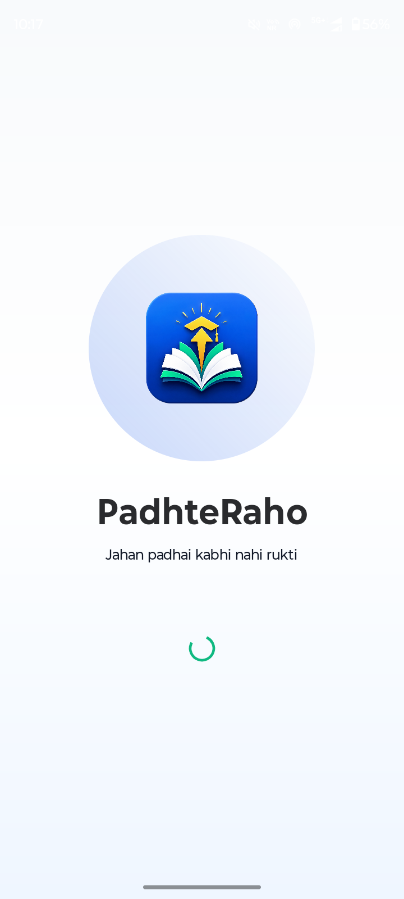
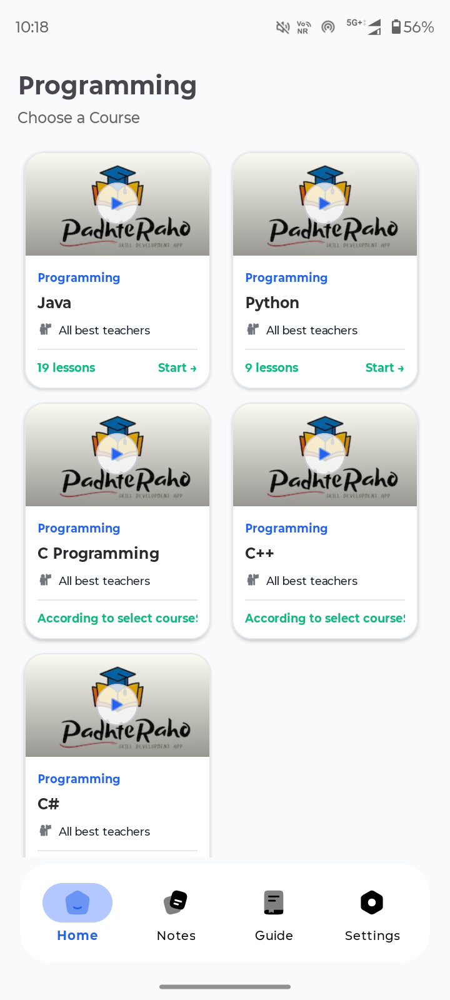

# 📚 PadhteRaho

  <h3 align="center">Learn Smarter, Anytime, Anywhere 🚀</h3>
  

    A free Android educational application with category-wise courses, playlists, and study resources.
  

---

## ✨ Features

- 📖 Simple & Clean User Interface
- 🎯 Category-wise Course Organization
- ▶️ Dedicated Playlist for Every Course
- 📚 Free Educational Content
- 📱 Smooth & Easy Navigation
- ⚡ Lightweight & Fast Performance
- 🎓 Perfect for Students & Self Learners

---

## 📸 Screenshots

| Home | Courses |
|------|---------|
|  |  |

| Notes | Player |
|------|---------|
|  |  |

---

## 📥 Download

Download the latest version from the **Releases** section.

➡️ **Latest APK:**  
https://github.com/USERNAME/REPOSITORY/releases/latest

---

## 🛠️ Built With

- Java
- Android Studio
- Firebase Realtime Database
- Material Design 3
- Android YouTube Player

---

## 🎯 App Highlights

- Organized Learning Experience
- Multiple Categories
- Playlist-Based Courses
- Free Study Resources
- Student Friendly Interface

---

## 👨‍💻 Developed By

**Aditya Saini**

GitHub: https://github.com/adityasaini404

---

## ⭐ Support

If you like this project, don't forget to ⭐ the repository.

Happy Learning ❤️
